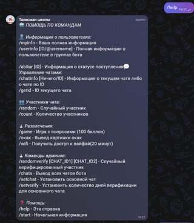
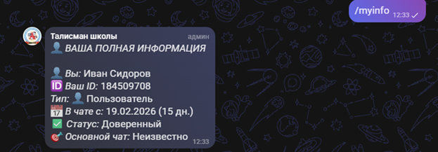
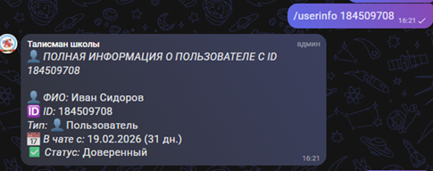
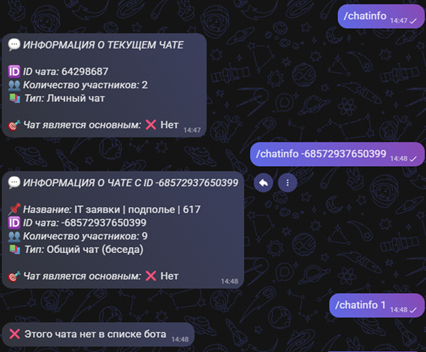
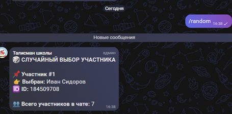
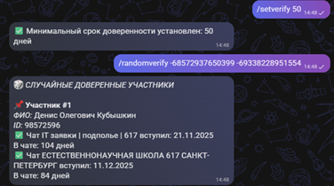
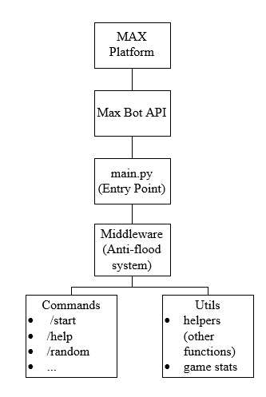

# MAX Chat Bot

A multifunctional bot for the **MAX** platform that provides chat administration, moderation tools, user information commands, and interactive features.

## Project Background

This project was developed as part of an internship project for managing and moderating a school group chat.

## Features

* 👋 `/start` command
* 📖 Built-in help system (`/help`)
* 👤 User information
* 🆔 Get user or chat ID
* 💬 Chat information
* 🎲 Random member selection
* 🔢 Counting members
* 🔇 Anti-spam and flood protection
* ✅ System of member verification
* 📅 Configurable trust period for members
* 🎮 Mini-games
* 📡 List all chats where the bot is present
* ⚙️ Additional moderation and administration commands
  
## Screenshots

### Help Command



### User Information





### Chat Information



### Random Commands




## Project Structure

```text
MAX-chat-bot/
│
├── commands/              # Command handlers
├── utils/                 # Utility functions
├── config.py              # Bot configuration
├── logger_config.py       # Logging configuration
├── mute_command.py        # Moderation commands
├── mute_middleware.py     # Anti-spam middleware
├── main.py                # Application entry point
└── README.md
```
## Tech Stack

### Language
- Python 3.10+

### Platform & API
- MAX Bot API (maxapi)

### Architecture
- Async programming
- Middleware architecture
- Modular command architecture

## Requirements

* Python 3.10+
* `maxapi` library
* `paramiko` library
* `pandas` library

## Installation

Clone the repository:

```bash
git clone https://github.com/<your-username>/MAX-chat-bot.git
cd MAX-chat-bot
```

Install the dependencies:

```bash
pip install -r requirements.txt
```

> If the project does not include a `requirements.txt` file, install the required libraries manually (including `maxapi` and any other dependencies).

## Configuration

Open `config.py` and configure the required values:

```python
TOKEN = "YOUR_BOT_TOKEN"

ADMINS_ID = [
    123456789
]

MAIN_CHAT_ID = 123456789
TRUST_DAYS = 7
```

### Configuration Options

| Variable       | Description                                          |
| -------------- | ---------------------------------------------------- |
| `TOKEN`        | Your bot token                                       |
| `ADMINS_ID`    | List of administrator IDs                            |
| `MAIN_CHAT_ID` | ID of the main chat                                  |
| `TRUST_DAYS`   | Number of days before a member is considered trusted |

## Running the Bot

```bash
python main.py
```

or

```bash
python3 main.py
```

## Available Commands

| Command            | Description                             |
| ------------------ | --------------------------------------- |
| `/start`           | Start the bot                           |
| `/help`            | Show the help menu                      |
| `/myinfo`          | Display your profile information        |
| `/chatinfo`        | Show information about the current chat |
| `/getid`           | Get a user or chat ID                   |
| `/random`          | Select a random member                  |
| `/count`           | Count members in chat                   |
| `/game`            | Play mini-games                         |
| `/set_verify_days` | Configure the trust period              |
| `/randomverify`    | Verify random members                   |

> Additional commands can be found in the `commands/` directory.

## Architecture

The project is organized into independent modules:

* **commands/** — command handlers
* **utils/** — helper utilities
* **middleware** — message processing and anti-spam protection
* **config.py** — centralized configuration

This modular architecture makes the project easy to maintain and extend with new features.



## Development

To add a new command:

1. Create a new file inside the `commands/` directory.
2. Register the command handler.
3. Import the module in `main.py`.

## 📄 License

This project is licensed under the MIT License.
